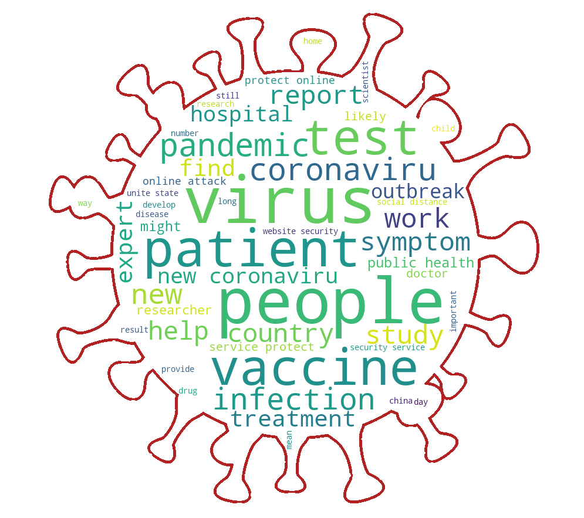

# COVID19-news

The increasing number of Novel Coronavirus (COVID-19) cases has given rise to a proliferation of misinformation related to COVID-19. This misinformation makes it difficult for individuals to find reliable news sources, resulting in protest against government measures to control the virus, social turmoil, and even death. To help alleviate the spread of misinformation, we built and evaluated a variety of machine learning models to help predict the reliability of COVID-19 related news. We combined data from two sources, which include news articles and website posts from official institutions. As our final method, we presented an ensemble of methods that achieves an Area Under Curve (AUC) of 0.97 and an F1-score of 0.92. Additionally, we created a website for readers to interact with the model at: www.modellingcomp.com.

This repo includes only some parts of the project:

**News_similarity.ipynb** finds a similar news to any input.

**Word_cloud_and_scatter_text.ipynb** depicts word could and scatter text (https://mohsenbah.github.io/COVID19-news/) 

**passive aggressive classifier for fake news detection.ipynb** compares passive aggressive classifier for fake news detection with MultinomialNB, SVC, LogisticRegression.
